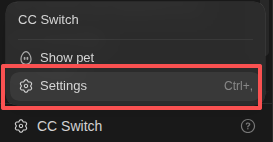
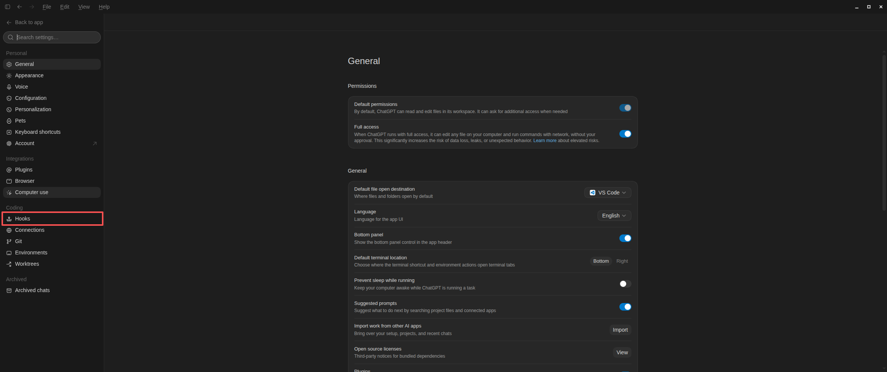

<h1 align="center">DevopsFlow</h1>

<p align="center">
  
</p>

<p align="center">
  面向 Codex 的工程工作流与 agent harness，让 AI 先理解、再计划、后执行。
</p>

## Scope

DevopsFlow 不是单纯的 skills 汇总，而是一组可组合的工程流程与执行约束：

- `skills` 负责路由 DDD、TDD、调试、评审、验证和发布等工程工作流。
- `hooks` 在关键操作前后提供分支保护、状态检查与运行时资产引导。
- MCP 接入用于连接外部工具和工程系统，并纳入同一套执行流程。
- `agent` 定义专门角色，`agent harness` 提供执行、编排、约束与反馈载体。
- Codex 与 OpenCode 适配层让上述能力在不同宿主中保持一致。

这些能力共同支持任务路由、长任务检查点、实现与验证，以及受保护分支上的安全协作。

## Installation Plugin or Update Plugin

### Codex

```bash
codex plugin marketplace add LiTeXz/devopsflow
codex plugin marketplace upgrade devopsflow
codex plugin add devopsflow@devopsflow
```

安装完成后，重新打开 Codex 任务。

更新 marketplace 快照并刷新插件：

```bash
codex plugin marketplace upgrade devopsflow
codex plugin add devopsflow@devopsflow
```

当前 Codex CLI 没有 `codex plugin update` 子命令；`plugin add` 是已配置 marketplace 中插件的安装/刷新入口。

> hooks 需要用户显式打开，在 codex desktop 当中
> `Settings` -> `Hooks`
> 
> 

### Cursor

Cursor 支持从本地检出的仓库安装。Linux 和 macOS 执行：

<details>

```bash
mkdir -p ~/.cursor/plugins/local
ln -s "$(pwd)" ~/.cursor/plugins/local/devopsflow
```

Windows PowerShell 执行：

```powershell
New-Item -ItemType Directory -Force "$HOME\.cursor\plugins\local"
New-Item -ItemType Junction -Path "$HOME\.cursor\plugins\local\devopsflow" -Target (Get-Location)
```

该插件通过 `.cursor-plugin/plugin.json` 声明 Cursor 插件，通过 `skills/` 暴露工程工作流，并加载 `hooks/hooks.cursor.json`。Cursor hooks 会在会话开始时更新受保护分支，在 Shell 工具执行前阻止 Agent 直接提交或推送 Git 变更，并在编辑后运行适用的格式化检查。

</details>

### OpenCode

下载本仓库后，在项目的 `opencode.json` 中添加：

```json
{
  "$schema": "https://opencode.ai/config.json",
  "plugin": ["/absolute/path/to/devopsflow/.opencode/plugin/devopsflow.ts"],
  "skills": {
    "paths": ["/absolute/path/to/devopsflow/skills"]
  }
}
```

将示例中的路径替换为本仓库的实际路径，然后重新启动 OpenCode。

## Usage

1. 在 Codex 中开启 Plan 模式。
2. 像平常一样描述需求。
3. DevopsFlow 会选择所需工作流，并引导任务完成澄清、实现和验证。

## Notes

在 `main`、`dev`、`develop`、`devlop` 等集成分支上，DevopsFlow 会提醒创建新分支，
并阻止直接写入、提交或推送。请通过功能分支和 PR 完成变更。

## Why DevopsFlow

项目名称的语义推导路径是 `devflow-skills` → `devflow` → `devopsflow`：先去除将能力限定为 skills 的后缀，再用 DevOps 表达开发、验证、交付、运行和反馈组成的完整工程环境。这是命名语义的推导，不要求 GitHub 仓库经历两次物理重命名。

这里的 DevOps 不是狭义的运维模块，也没有削弱 `Dev`。编码、单元测试和功能性测试仍是核心开发活动；`Ops` 强调它们所依赖的服务、数据、工具链、自动化、可观测性、运行环境与反馈闭环。

因此，TDD 与验证是一条不可割裂的连续链路：单元测试和功能性测试验证局部与用户行为，集成测试验证真实协作边界，属性测试扩大输入空间，灰度测试在受控环境中验证发布风险，线上问题排查测试把真实故障转化为可复现的回归证据。应按风险选择最小有效层级，并记录环境与运行证据，而不是把依赖环境的测试排除在开发工作流之外。

## Migration and Compatibility

- GitHub 仓库、插件、包、marketplace 和新增文档统一使用 `devopsflow`，展示名称统一使用 `DevopsFlow`。
- 面向用户的安装命令、配置示例和新代码不再使用旧名称；插件、包和 marketplace 不提供旧标识别名。
- 历史 Git 提交、标签和发布记录保持不变，不重写已经发布的来源信息。
- GitHub 仓库重命名后的旧地址仅作为平台重定向兼容入口；新引用必须使用当前仓库地址。
- 引用仍带旧名称的上游、第三方来源或历史记录时，保留其原始归属并明确标注为历史来源，不将旧名称复制到当前配置。

## More

- [参与贡献](CONTRIBUTING.md)
- [GNU General Public License v3.0](LICENSE)
